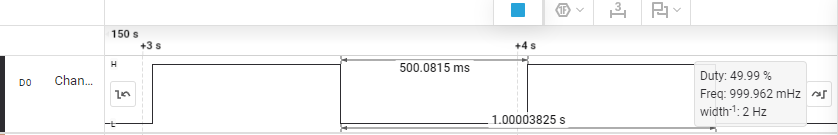
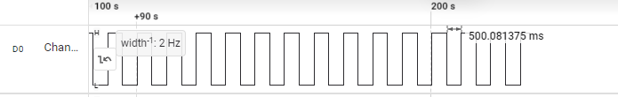
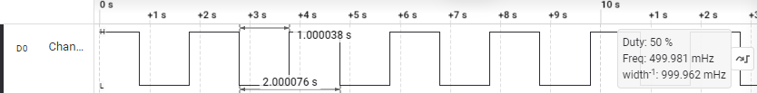
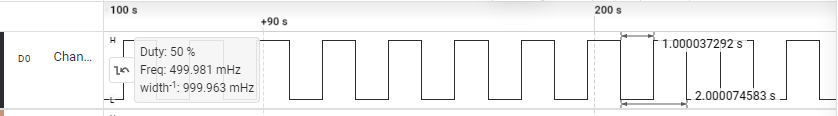

# SRTOS — Testing and Validation

## Overview

This document describes the hardware testing and validation performed on SRTOS. All tests were executed on a physical STM32F411E-Discovery board to verify kernel scheduling, timing accuracy, and stability. You may also run the same tests using the same STM32 board.

## Test Environment

| Component     | Details                                                    |
| ------------- | ---------------------------------------------------------- |
| **Board**     | STM32F411E-DISCO (STM32F411VET6 Microcontroller)           |
| **Host OS**   | macOS 26.0.1                                               |
| **Toolchain** | GNU Arm Embedded Toolchain 14.3.Rel1 (`arm-none-eabi-gcc`) |

SRTOS and the example LED blink program was run by following the exact steps in the `Installation & Usage` section of `README.md` in the root of this repository.

## LED-Blink Verification

The **LED blink example** runs two concurrent tasks with the same priorities but different delay intervals.  
Each task toggles a different on-board LED at a unique rate, validating:

- Preemptive context switching
- Deterministic tick timing
- Correct operation of `taskDelay()`
- Stability under continuous switching

Refer to the `Examples/` directory for the code used in this test.

### **Expected Behavior and Results**

| LED       | Blink Rate  |
| --------- | ----------- |
| **Green** | 0.5 Seconds |
| **Blue**  | 1 Second    |

Both LEDs are observed to blink at the correct rates and the system remains responsive indefinitely, which verifies that the scheduler, tick timing, and context switching are functioning correctly.

## Logic-Analyzer Verification

To further validate the scheduler's timing and SysTick accuracy, a logic-analyzer was used to measure GPIO pins:

1. Connect a logic-analyzer to GPIO Pins PD12 (Green LED) and PD15 (Blue LED)
2. Begin recording respective channels
3. Verify: PD12 toggles every 0.5 seconds, PD15 toggles every 1 second, and accuracy is consistent across long periods of time.

### **Results**

#### **PD12 - 0.5 seconds**

It can be observed that the toggling time of the GPIO pin PD12 is **almost exactly** `500 ms`, with an error of about `0.0815 ms`:

After around `200 seconds` of concurrent running, PD12 was still being toggled at a time very close to `500ms`, with an error of about `0.081375 ms`:

#### **PD15 - 1 seconds**

It can be observed that the toggling time of the GPIO pin PD15 is **almost exactly** `1 second`, with an error of about `0.000038 seconds`:

After around `200 seconds` of concurrent running, PD15 was still being toggled at a time very close to `1 second`, with an error of about `0.000037292 seconds`:

